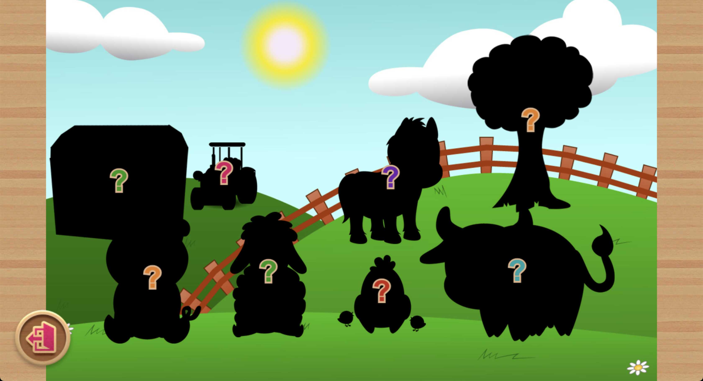

# Kids Puzzle Adventure

Originally written from scratch, in vanilla JS, back in 2014, and posted for sale on [Codecanyon](https://codecanyon.net/).

The game was also configured for build on iOS and Android using Apache Cordova.

This project is no longer maintained or revisited, except that I'm translating part of the code into pure TypeScript, formalizing the core logic into an elemental 'game engine' ([Emerald-Pixi](https://github.com/xtiandiaz/emerald-pixi)), and using it as source and inspiration for an alternative puzzle game.

